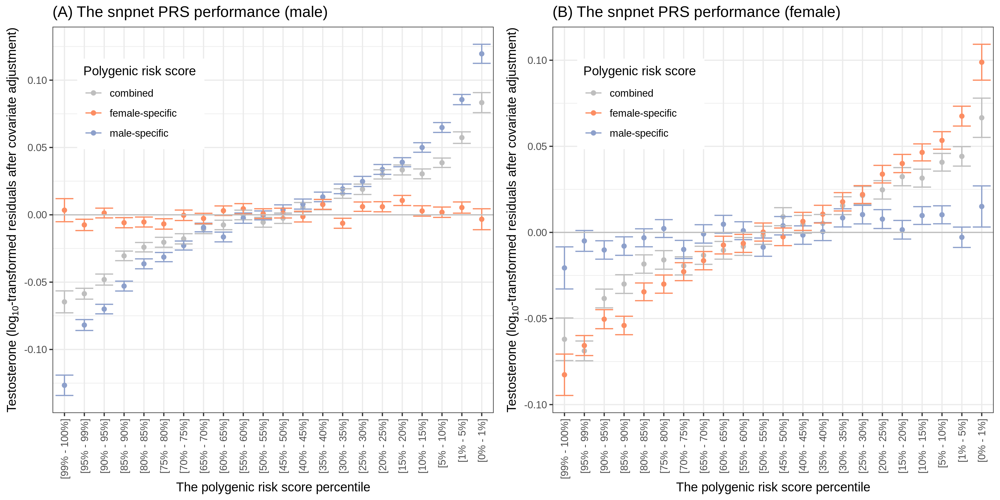
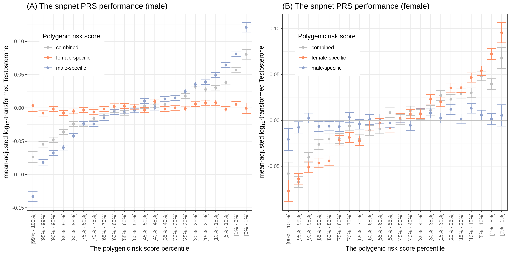

# Polygenic risk modeling with `snpnet`

We evaluated the performance of the `snpnet` PRS models using a held-out test set.

The source files summarizing the data points shown in the figures are in [`tbls`](tbls) directory.

## The snpnet performance plot with the full set of covariates

- [`Testosterone.combined.png`](Testosterone.combined.png)
- [`Testosterone.combined.pdf`](Testosterone.combined.pdf)

## The snpnet performance plot with a minimum set of covariates

For this analysis, we used `age, PC1-10` as covariates for the male- and female-specific models, and `sex, age, PC1-10` for the combined model.

- [`Testosterone.combined.basic-covars.png`](Testosterone.combined.basic-covars.png)
- [`Testosterone.combined.basic-covars.pdf`](Testosterone.combined.basic-covars.png)
