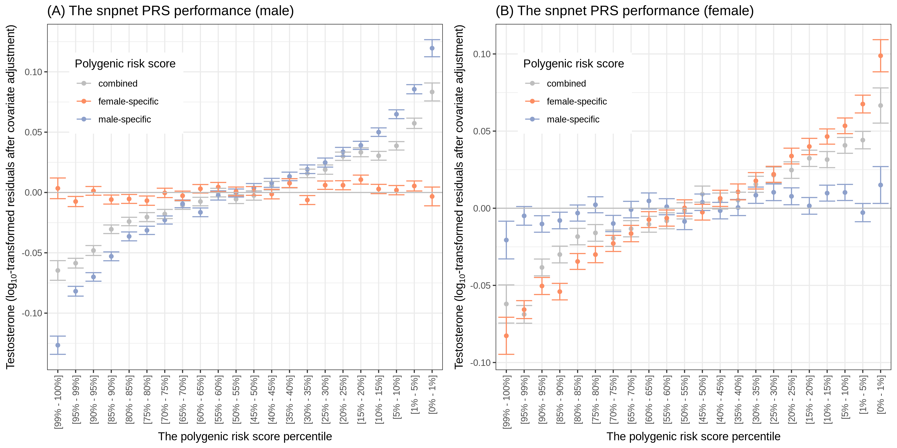

# Polygenic prediction of Testosterone level using `snpnet`

We constructed polygenic risk scores (PRSs) using [snpnet](https://github.com/rivas-lab/snpnet).

## sub-directories

The PRS analysis consists of 3 steps and the analysis scripts used in each the steps are organized in the following directories.

- [`1_phe_data_prep`](1_phe_data_prep): scripts & notebooks to prepare input file (phenotype file) for `snpnet`
- [`2_snpnet-wrapper`](2_snpnet-wrapper): scripts to call `snpnet` in our cluster computing environment and the post-processing scripts.
- [`3_plots`](3_plots): we evaluate the predictive performance of our PRS models and generate plots.
